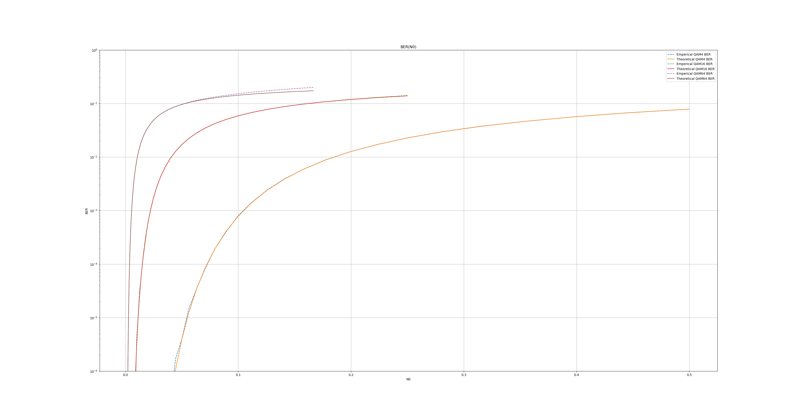
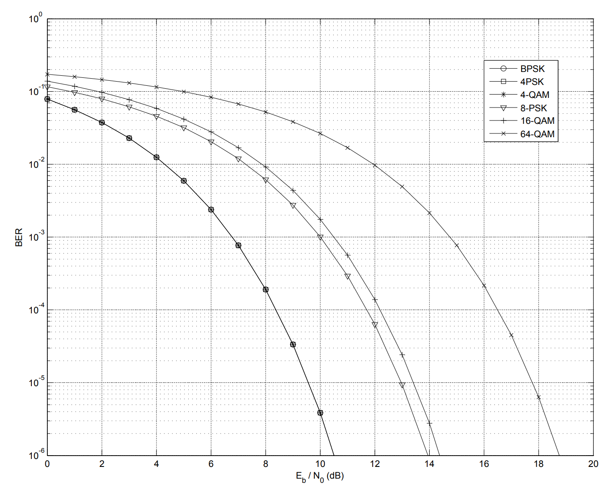

# Тестовое задание YADRO IMPULSE 2026

## Запуск

```
Установка зависимостей
./install.sh

Сборка
mkdir -p build && cd build
cmake ..
make

Тесты
./tests

Запуск модели
./main
```

## Задачи
1. Написать на языке С++ класс выполняющий функциональность модулятора QAM (QPSK, QAM16, QAM64).
2. Написать на языке С++ класс выполняющий функциональность добавления гауссовского шума к созвездию QAM.
3. Написать на языке С++ класс выполняющий функциональность демодулятора QAM (QPSK, QAM16, QAM64).
4. Написать последовательный вызов 1-3 для случайной последовательности бит для разных значений дисперсия шума.
5. Построить график зависимости вероятности ошибки на бит от дисперсии шума

## Примечание
Обратите внимание на файлы main.cpp -> simulation.cpp -> QAM_modem.cpp -> channel.cpp. В этих файлах собраны основные функции и методы.

## Документация

Задание выполнено на C++.
Из сторонних библиотек используется spdlog (вывод логов) и matplotlibcpp (визуализация). Сборка выполняется с помощью Cmake.

Сборка в docker сделана только для уверенности, что код не упадет у проверяющего.

## QAM модулятор/демодулятор

**Описание** и **реализацию** модулятора и демодулятора можно найти в файлах **include/QAM_modem.hpp** и **src/QAM_modem.cpp**.

### Модулятор

#### Описание

Модуляция выполняется по стандарту [3GPP](https://www.etsi.org/deliver/etsi_ts/138200_138299/138211/18.06.00_60/ts_138211v180600p.pdf) (chapter 5).

Модуляция выполняется по предварительно сгенерированному созвездию. Генерация происходит в конструкторе, т.е при создании объекта модулятора/демодулятора.

Созвездие представляет собой массив, ячейки которого хранят символ в виде комплекского числа, а индекс ячейки является последовательностью бит для этого символа.

Это позволяет не делать вычисления для каждого символа, а один раз посчитать созвездие, а потом просто обращаться к определенным ячейкам массива за результатом.

Созвездия генерируются с применением кода Грея. Соседние точки созвездия отличаются не более чем на 1 бит. Это уменьшает BER на приеме, т.к,  если из-за шума демодулятор ошибется с выбором передаваемого символа, то будет только 1 ошибка (если демодулятор перепутал соседние точки).

#### Тесты

Для уверенности в правильности созвездия в файле **tests/QAM_modem.cpp** выполняется генерация всех созвездий и их отрисовка. Точки созвездия имеют подписи в виде соотвуствующих им битов.


### Демодулятор

#### Описание

В модели можно выбрать один из двух методов демодуляции: через нахождение ближайшей точки созвзедия (soft) и через сравнение с пороговыми значениями (hard).

### Тесты

Для проверки корректности работы в файле **/tests/QAM_modem_test.cpp** генерируются биты, переводятся в символы, а потом из символов снова переводятся в биты. Далее начальные и новые биты сравниваются.

## Канал

**Описание** и **реализацию** канала можно найти в файлах **include/channel.hpp** и **src/channel.cpp**

### Описание 
В модели используется AWGN канал.

Такой канал искажает сигнал путем добавления к сигналу гауссовского шума $N(0, \sigma^2)$. Т.к отсчеты у нас комплексные, то и шум будет комплексным $C(N(0, \frac{\sigma^2}{2}), N(0, \frac{\sigma^2}{2}))$. 

### Тесты

При добавлении AWGN созвездие сигнала "рассыпается". Для проверки этого сгененрируем символы, добавим к ним AWGN и визуализируем результат


*На графике ошибка: SNR=24, а не 12*

Видим, что созвездие слегка "рассыпалось" из-за шума.


## Работа модели

Pipline модели находится в файлах **src/main.cpp** (вызов симуляции и визуализация) и **src/simulation.cpp** (pipeline симуляции).

Модель для каждого вида модуляции выполняет следующие действия:
1. Сгенерировать N битов
2. Выполнить модуляцию
3. Добавить AWGN
4. Выполнить демодуляцию
5. Вычислить BER

Такой pipeline прогоняется K раз, накапливая BER, а потом BER усредняется по реализациям. Такой алгоритм называется "Монте-Карло". Он позволяет добиться большей точности за счет выполнения большого числа экспериментов.


### Анализ результатов

Итогом задания является анализ результатов работы модели - оценки BER на приеме в зависимости от уровня SNR или дисперсии шума.

Для этого на одном графике построим кривые BER, полученные экспериментальным путем и посчитанные по теоретическим формулам. 

Если эмпирические кривые совпадут с теоретическими, то модель работает верно

Зависимость BER от дисперсии шума


Зависимость BER от SNR


Сторонние рассчеты теоретического BER


Результат симуляции очень близок к теории, но все-таки имеются небольшие расхождения. Это может быть связано с погрешностями в вычислениях или недостаточным кол-вом реализаций/битов.

Можно заметить, что с ростом порядка модуляции возрастает BER. Это связано с ростом количества точек созвездия и их более близким расположением. При добавлении шума приемнику становится сложнее правильно принять решение о переданном символе.

Модуляция с более низким порядком будет демонстировать более низкие скорости передачи данных, но при этом она более помехоустойчива. Важен баланс, который зависит от радиоусловий.


