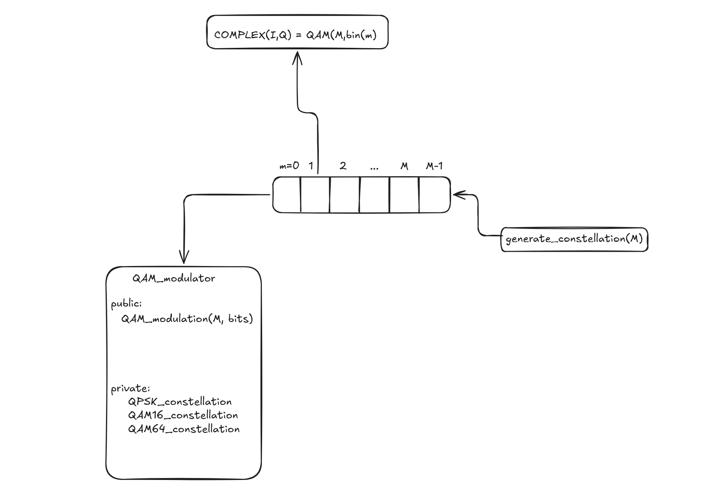
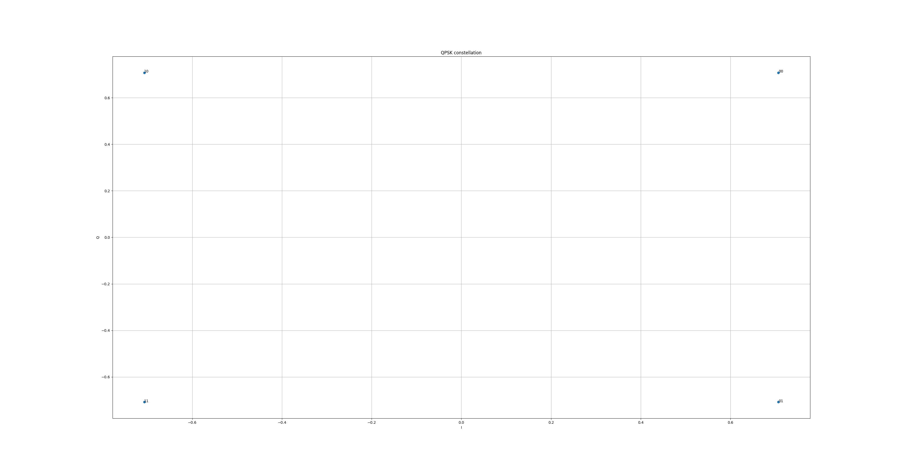
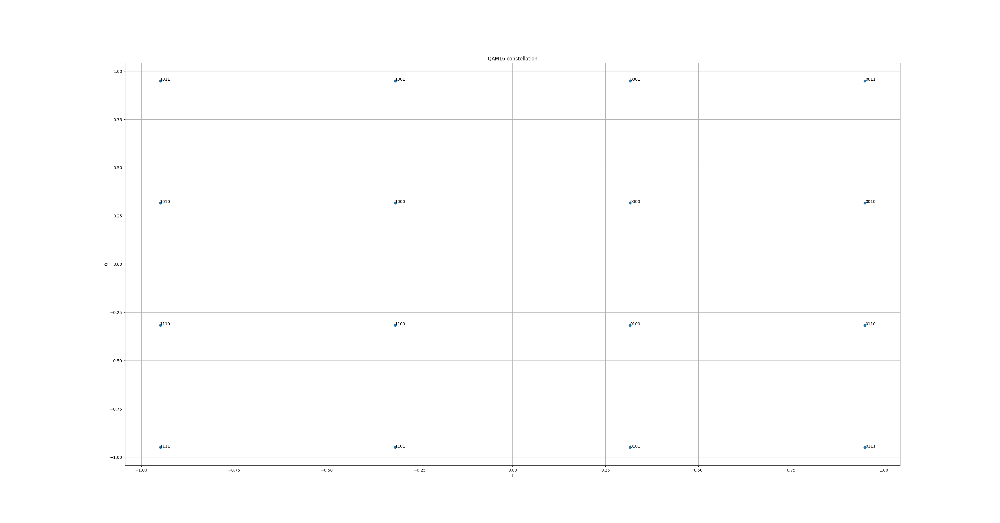
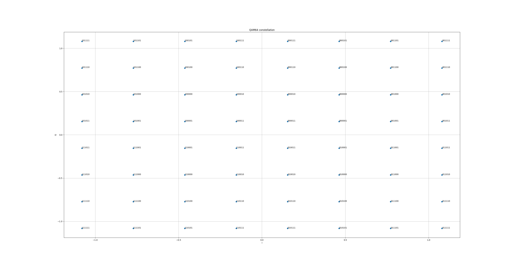
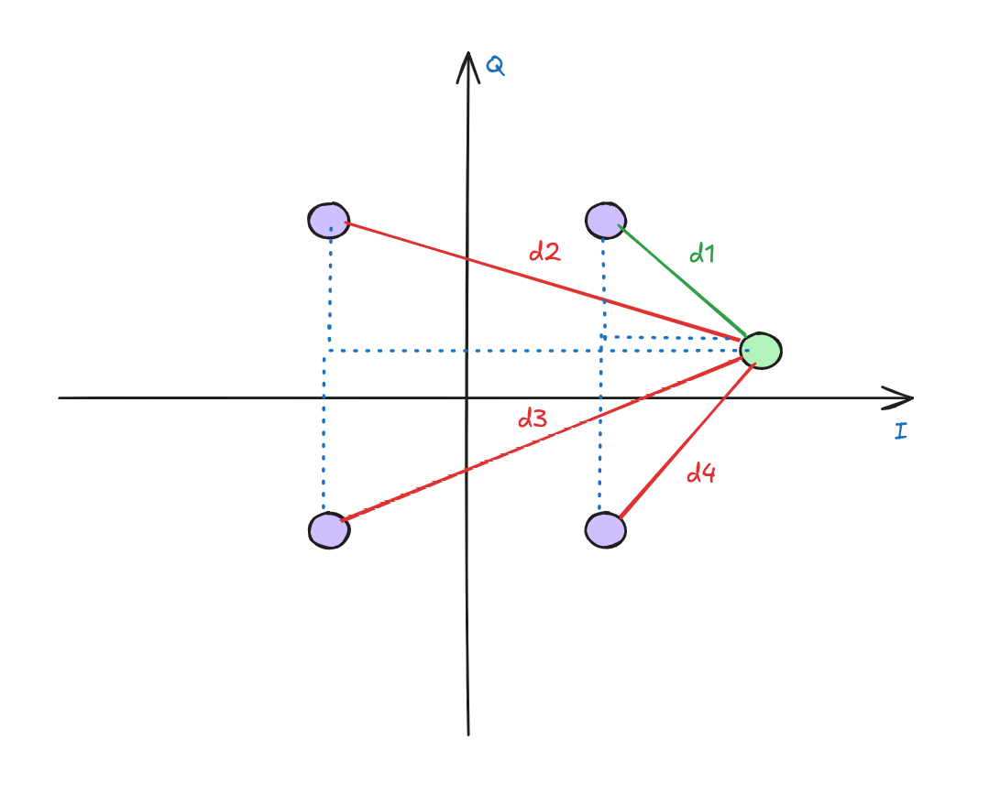
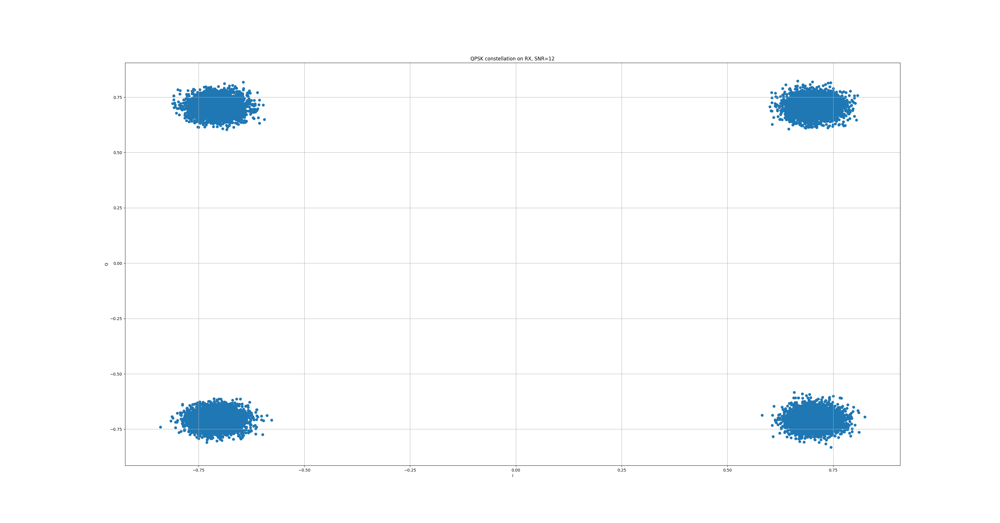
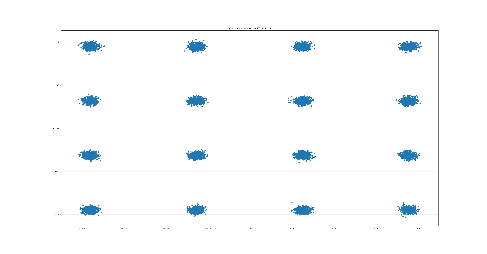
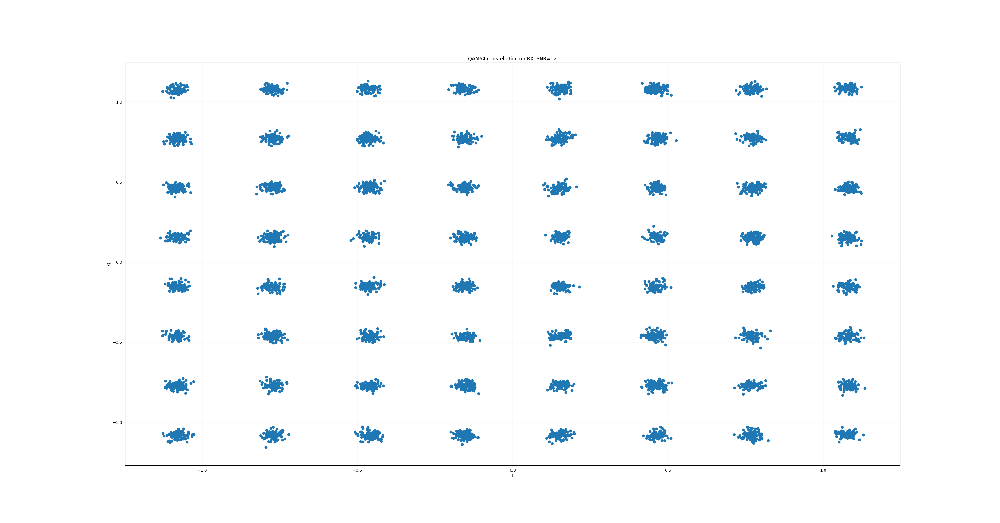
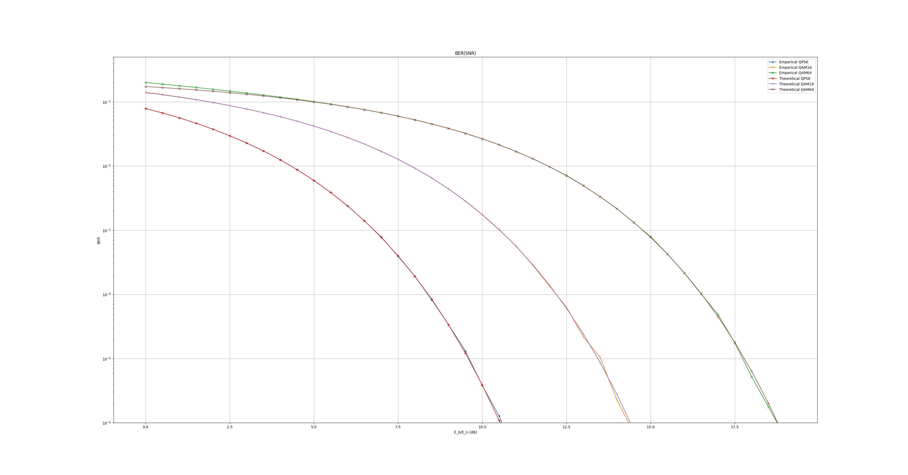

# Тестовое задание YADRO IMPULSE 2026

## Запуск

```
Установка зависимостей
./install.sh

Сборка
mkdir -p build && cd build
cmake ..
make

Тесты
./tests

Запуск модели
./main

Построить графики
python analyzer.py
```

## Задачи
1. Написать на языке С++ класс выполняющий функциональность модулятора QAM (QPSK, QAM16, QAM64).
2. Написать на языке С++ класс выполняющий функциональность добавления гауссовского шума к созвездию QAM.
3. Написать на языке С++ класс выполняющий функциональность демодулятора QAM (QPSK, QAM16, QAM64).
4. Написать последовательный вызов 1-3 для случайной последовательности бит для разных значений дисперсия шума.
5. Построить график зависимости вероятности ошибки на бит от дисперсии шума

## Описание

Задание выполнено на C++ и Python. Вся модель выполнена на C++. Python используется только для визуализации.
Из сторонних библиотек используется spdlog (вывод логов). Сборка выполняется с помощью Cmake.

Сборка в docker сделана только для уверенности, что код не упадет у проверяющего.

## QAM модулятор/демодулятор

**Описание** и **реализацию** модулятора и демодулятора можно найти в файлах **include/QAM_modem.hpp** и **src/QAM_modem.cpp**.

### Модулятор

#### Описание

Модуляция выполняется по стандарту [3GPP](https://www.etsi.org/deliver/etsi_ts/138200_138299/138211/18.06.00_60/ts_138211v180600p.pdf) (chapter 5).

Структура модулятора:



Модулятор имеет один метод **QAM_modulation(M, bits)**, который выполняет модуляцию битов **bits** для **M=4,16,64** (кол-во точек в созвездии). 

Модуляция выполняется по предварительно сгенерированному созвездию. Генерация происходит в конструкторе, т.е при создании объекта.

Генерацией созвездий занимается функция **generate_constellation(M)**, которая вынесена из класса, т.к используется еще и в демодуляторе. Она возвращает созвездие в виде массива, ячейки которого хранят символ в виде комплекского числа, а индекс ячейки является последовательностью бит для этого символа.

Это позволяет не делать вычисления для каждого символа, а один раз посчитать созвездие, а потом просто обращаться к определенным ячейкам массива за результатом за О(1) (в данной модели это не имеет значения, т.к порядки модуляции маленькие, но при больших порядках и большом потоке данных это может дать преимущество).

Атрибуты QPSK_constellation, QAM16_constellation, QAM64_constellation хранят созвездия.

Созвездия генерируются с применением кода Грея. Соседние точки созвездия отличаются не более чем на 1 бит. Это улучшает уменьшает BER на приеме, т.к,  если из-за шума демодулятор ошибется с выбором передаваемого символа, то будет 1 ошибка (если демодулятор перепутал соседние точки).

#### Тесты

Для уверенности в правильности созвездия в файле **tests/QAM_modem.cpp** выполняется генерация и запись в файл всех созвездий. В этой же директории находится Python скрипт, отрисовывающий точки созвездия с подписями в виде соотвуствующих им битов.





```
Отрисовка созвзедия
python analyzer.py

Предварительно нужно прогнать тесты
cd build
./tests
```

### Демодулятор

#### Описание
Демодулятор имеет структуру, идентичную модулятору, но вместо метода **QAM_modulation** у него метод **QAM_demodulation**.

Демодуляция выполняется с применением того же сгенерированного созвездия.

Для принятия решения о переданном символе, демодулятор вычисляет для каждого принятого символа расстояния между всеми точками созвездия и выбирает точку (символ) с наименьшим расстоянием.



### Тесты

Для проверки корректности работы есть отдельный тест, который генериурет биты, переводит их в символы, а потом из символов снова в биты. Далее начальные и новые биты сравниваются.

## Канал

**Описание** и **реализацию** канала можно найти в файлах **include/channel.hpp** и **src/channel.cpp**

### Описание 
В модели используется AWGN канал.

Эта модель добавляет к каждому отсчету сигнала отсчет комплексного гауссовского шума $C(\Nu(0, \sigma), \Nu(0, \sigma))$.

Чтобы правильно задать шум, нужно вычислить его дисперсию.

В модели задается $SNR = \frac{E_b}{E_n}$ db. Зная сигнал, можно найти энергию на символ $E_s$:

$$E_s = \frac{1}{N}\sum_{i=0}^Nsignal[i]^2$$

А далее энергию на бит:

$$E_b = \frac{E_s}{k}$$
где k - кол-во бит на символ

После этого можно найти спекральную плотность шума как $N_0=\frac{E_b}{SNR}$. Перед этим необходимо перевести SNR в линейный масштаб.

Дисперсию шума можно вычислить как $\sigma = \sqrt{\frac{N_0}{2}}$. Деление на 2 появляется из-за того, что шум комплексный, поэтому его мощность нужно разделить между синфазной и квадратурной частями.

### Тесты

При добавлении AWGN созвездие сигнал только "рассыпается" (нет поворота созвездия). Для проверки этого сгененрируем символы, добавим к ним AWGN и запишем в файл, а с помощью скрипта на Python визуализируем результат




*На графике ошибка: SNR=24, а не 12*

Видим, что созвездие слегка "рассыпалось" из-за шума. Когда шума слишком много, то точки перемешаются и демодулятор начнет ошибаться.


## Работа модели

Pipline модели находится в файле **src/main.cpp**. Модель может работать долго, поэтому можно уменьшить кол-во генерируемых битов или уменьшить кол-во реализаций (кол-во битов должно быть кратно 2,4,6. Тогда битов будет хватать на целое число символов).

Модель для каждого вида модуляции выполняет следующие действия:
1. Сгенерировать 102К битов
2. Выполнить модуляцию
3. Добавить AWGN
4. Выполнить демодуляцию
5. Вычислить BER

Такой pipeline прогоняется 100 раз, накапливая BER, а потом BER усредняется по реализациям. Такой алгоритм называется "Монте-Карло". Он позволяет добиться большей точности за счет выполнения большого числа экспериментов. С увелеичением числа экспериментов результат симуляции будет стремиться к истинне (теоретическому значению).


### Анализ результатов

Итогом задания является анализ результатов работы модели - оценки BER(Bit Error Rate) на приеме в зависимости от уровня SNR (Signal-to-Noise-Ratio).
Для этого на одном графике построим кривые BER, полученные экспериментальным путем и посчитанные по теоретическим формулам. Если эмпирические кривые совпадут с теоретическими, то модель работает верно



Результат симуляции очень близок к теории, но все-таки имеются небольшие расхождения. Это может быть связано с погрешностями в вычислениях или недостаточным кол-вом реализаций/битов.

Можно заметить, что с ростом порядка модуляции возрастает BER. Это связано с ростом количества точек созвездия и их более близким расположением. При добавлении шума демодулятору становится сложнее правильно принять решение о переданном символе.

Модуляция с более низким порядком будет демонстировать более низкие скорости передачи данных, но при этом она более помехоустойчива. Важен баланс, который зависит от радиоусловий.


